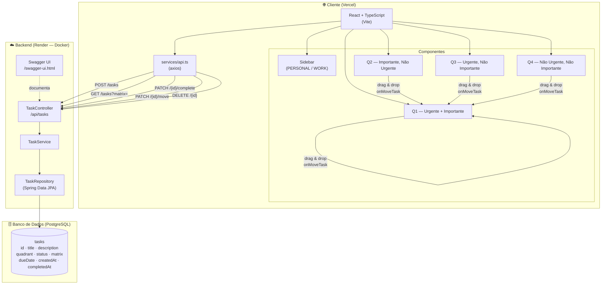

# Arquitetura do Projeto — Matriz de Eisenhower

## Fluxo resumido

1. O usuário escolhe a **matriz** (Pessoal ou Trabalho) na Sidebar
2. O frontend busca as tarefas via `GET /tasks?matrix=` e distribui nos 4 quadrantes
3. Cada ação (criar, concluir, mover, deletar) dispara um request REST para o backend
4. O **TaskController** delega para o **TaskService**, que persiste no PostgreSQL via JPA
5. O backend roda em container Docker no Render; o frontend está no Vercel
